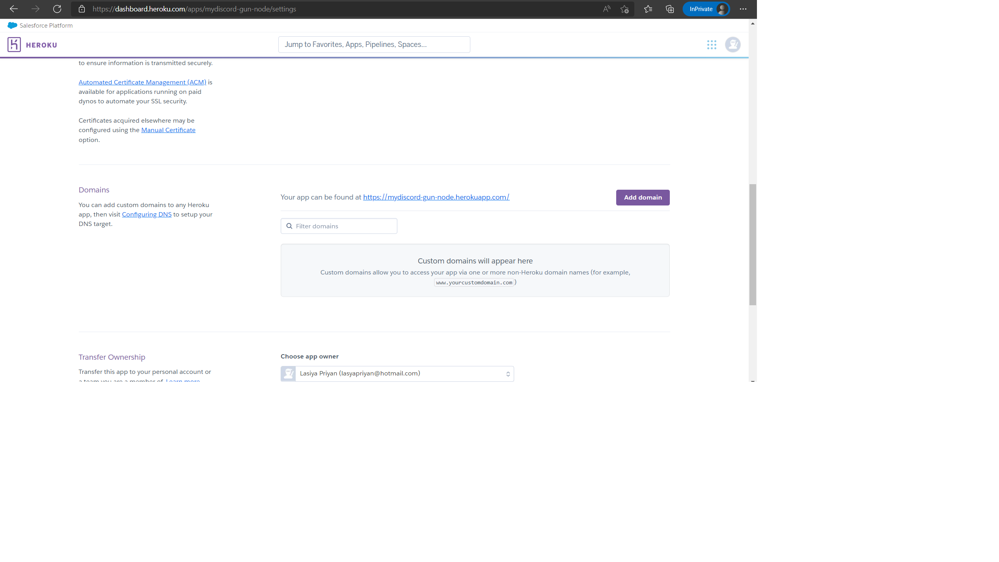

# Set-up

All data is going to be set up in an ecosystem of nodes, that are going to constantly be
syncing up data with each other. This model is what is otherwise known as a relational database.

1. Create 3 folders : client, server, studio

2. cd client and create-next-app@latest .

3. Install sanity yarn global add @sanity/cli and sanity init --coupon cleverprogrammer
   ..... for free database store

4. cd server and run yarn init. Give name for server and entry point "server.js".

_server will be utilizing gun js_

5. set up vercel

# Setup studio folder for Sanity

_First thing to do is to create our own schemas in schemas.js_

6. Create userSchema.js, conversationSchema.js and add needed schema for sanity data store.

# Deploying decentralized Gun node in gun.js

7. Go to server folder and create server.js and run "yarn add express cors gun"

8. Add gun js server set up

9. Create heroku account to run server. project name "mydiscord-gun-node"

_dashboard.heroku.com/apps_

10. git init in root folder. Use cmd to run "heroku git:remote -a mydiscord-gun-node" from root project dir to deploy repo to heroku.

11. git add, commit and "git push heroku master".

# Adding Sidebar

12. Create sidebar.js and add dummyChannels array of sample accounts.

13. create roomAvatar.js add roomAvatar.css styling

14.

15.

16.

# Add conversationList component

# MetaMask authentication and Context API

Install Gun.js yarn add gun.

Create file createUser.js in API folder.

Setup sanity into client folder yarn add @sanity.client.

Create lib folder in client and create client.js

Create .env.local file in client to keep token

sanity.io > project name > API > Add API token 'Name', Permissions: 'Editor'

Add CORS origin in https://\*vercel.app, check 'Allow Credentials'

import sanity client.js into api client.js

createDm.js, getChannels.js in API folder

_Dont' forget to go to \_app.js and wrap component with context providers_

pass in userAddress=currentAccount in createUserAccount function in context.js

# Adding dynamic data

manually create conversations and and users in sanity localhost:3333

go to next.config.js and add
images: {
domains: ["encrypted-tbn0.gstatic.com", "cdn.sanity.com"],
},

add useEffect to fetch user conversations to channels and dms

fill in changeURL router.push url function in dmCard.js

# Fully decentralized chat functionality

put onSubmit function in messageForm.js to send the message on form event so that the page doesn't reset state every time

add useContext and DiscordContext in chatView.js

New component MessageCard.js

Add <MessageCard> component in chatView.js.
